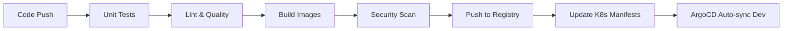
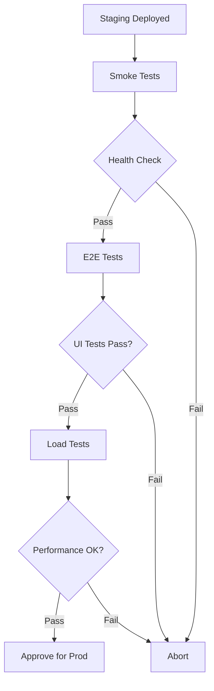
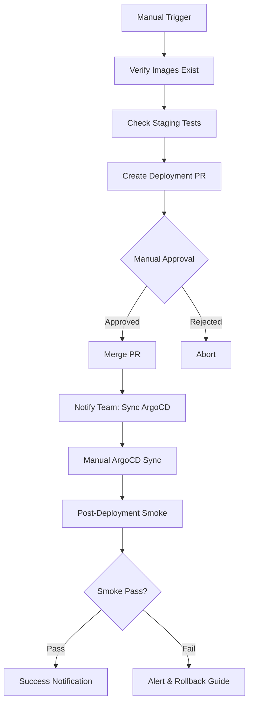

# 🔄 CI/CD Pipeline & Testing Strategy

## Overview
This document describes the complete CI/CD pipeline architecture with automated testing for the AI Incident Assistant application.

---

## 🏗️ Pipeline Architecture

### 1️⃣ CI Pipeline (`ci-pipeline.yml`)
**Trigger**: Push to `main` or Pull Request  
**Purpose**: Build, test, and publish container images



**Jobs**:
1. **Backend Test** - Unit tests, linting, SonarQube scan
2. **Frontend Test** - Linting, build validation, SonarQube scan
3. **Backend Build** - Docker build, Trivy security scan, push to registry
4. **Frontend Build** - Docker build, Trivy security scan, push to registry
5. **Update Manifests** - Update image tags in all K8s overlays (dev/staging/prod)

**Outputs**:
- Docker images: `registry.digitalocean.com/ai-incident-assistant/{backend,frontend}:${GIT_SHA}`
- Updated Kustomize manifests with new image tags
- Security scan results in GitHub Security tab

---

### 2️⃣ Staging Validation (`staging-validation.yml`)
**Trigger**: Manual dispatch or after staging deployment  
**Purpose**: Validate staging environment before production promotion



**Test Stages**:

#### 🔥 Stage 1: Smoke Tests (2-3 minutes)
- Health endpoint validation
- Critical API endpoints (incidents, analytics)
- Frontend availability
- Database connectivity

**Pass Criteria**: All endpoints return HTTP 200

#### 🎭 Stage 2: E2E Tests (10-15 minutes)
- User workflows with Playwright
- Incident creation flow
- Incident listing and filtering
- Analytics dashboard
- AI suggestion functionality
- Comment functionality

**Pass Criteria**: All E2E tests pass (see `tests/e2e/`)

#### 📊 Stage 3: Load Tests (5-10 minutes)
- Smoke test: 1 VU for 30 seconds
- Average load: 10 VUs for 5 minutes
- Stress test: Ramp up to 50 VUs

**Pass Criteria**:
- HTTP errors < 1%
- P95 response time < 2000ms
- No database connection failures

**Artifacts**:
- Playwright HTML report
- Test screenshots/videos (on failure)
- k6 JSON results with metrics

---

### 3️⃣ Production Deployment (`production-deployment.yml`)
**Trigger**: Manual workflow dispatch  
**Purpose**: Safe, controlled production deployments with approval gates



**Safety Features**:
1. **Pre-deployment Validation**
   - Verify images exist in registry
   - Check staging test results
   - Require manual approval

2. **Deployment PR Workflow**
   - Creates a deployment PR (not direct merge)
   - Requires code review approval
   - Documents changes and rollback plan
   - Labels: `deployment`, `production`, `needs-approval`

3. **Manual ArgoCD Sync**
   - No auto-sync for production
   - Team notification via Slack
   - Visual confirmation in ArgoCD UI

4. **Post-Deployment Validation**
   - Automated smoke tests
   - Health checks
   - Success/failure notifications

---

## 🧪 Testing Strategy

### Test Pyramid

```
        /\
       /  \
      / E2E \        ← Staging Validation (10-15 min)
     /______\
    /        \
   /   Load   \      ← Staging Validation (5-10 min)
  /___________\
 /             \
/  Unit Tests   \    ← CI Pipeline (2-5 min)
/_______________\
```

### Test Environments

| Environment | Purpose | Testing Level | Auto-Deploy |
|-------------|---------|---------------|-------------|
| **Dev** | Development | Manual/Ad-hoc | ✅ Yes (ArgoCD auto-sync) |
| **Staging** | Pre-production | Full automated suite | ❌ No (Manual ArgoCD sync) |
| **Production** | Live users | Smoke tests only | ❌ No (PR + Manual sync) |

---

## 📋 Deployment Workflows

### Development Deployment
```bash
# Automatic after CI pipeline completes
1. Push code to main
2. CI pipeline runs (5-10 min)
3. ArgoCD auto-syncs dev environment
4. Dev environment updated automatically
```

### Staging Deployment
```bash
# Semi-automatic with testing
1. CI pipeline completes → manifests updated
2. Login to ArgoCD: http://209.38.124.183
3. Select "ai-incident-staging" application
4. Click "Sync" button
5. Wait for sync to complete
6. Run staging validation tests:
   gh workflow run staging-validation.yml
7. Review test results before prod promotion
```

### Production Deployment
```bash
# Controlled, multi-step process
1. Trigger production deployment workflow:
   gh workflow run production-deployment.yml \
     -f image_tag=<GIT_SHA>

2. Workflow creates deployment PR automatically

3. Review PR:
   - Check image tags
   - Verify staging tests passed
   - Review rollback plan
   - Approve PR (requires team lead approval)

4. Merge PR

5. Workflow sends Slack notification

6. Login to ArgoCD: http://209.38.124.183

7. Select "ai-incident-prod" application

8. Click "Sync" button

9. Monitor deployment:
   - Watch pod rollout in ArgoCD
   - Check pod logs if issues
   - Automated smoke tests run

10. Verify success notification in Slack
```

---

## 🎯 Best Practices Implemented

### ✅ Build Once, Deploy Many
- Single image built in CI pipeline
- Same image deployed to dev → staging → prod
- Image tagged with git commit SHA
- No rebuilds between environments

### ✅ Progressive Deployment
```
Dev (auto) → Staging (manual + tests) → Prod (PR + approval + tests)
```

### ✅ Shift-Left Testing
- Unit tests in CI (before build)
- Security scans (Trivy, SonarQube)
- E2E tests in staging (before prod)
- Load tests in staging (before prod)

### ✅ Immutable Infrastructure
- Container images are immutable
- Kustomize overlays for environment differences
- GitOps with ArgoCD (Git as source of truth)

### ✅ Observability
- GitHub Actions summaries
- Slack notifications for key events
- Test artifacts stored for 7 days
- ArgoCD UI for deployment status

### ✅ Safety Gates
- Manual approval for production
- Automated rollback documentation
- Smoke tests after every deployment
- No auto-sync in production

---

## 🔧 Running Tests Locally

### E2E Tests (Playwright)
```bash
cd tests

# Install dependencies
npm install

# Run all E2E tests against staging
BASE_URL=http://staging.174.138.120.13.nip.io npm run test:e2e

# Run in headed mode (see browser)
npm run test:e2e:headed

# Debug mode
npm run test:e2e:debug

# View test report
npm run report
```

### Load Tests (k6)
```bash
cd tests

# Install k6 (Windows)
choco install k6

# Smoke test
BASE_URL=http://staging.174.138.120.13.nip.io k6 run load-tests/smoke-test.js

# Average load test
BASE_URL=http://staging.174.138.120.13.nip.io k6 run load-tests/incident-api-load.js

# Stress test
BASE_URL=http://staging.174.138.120.13.nip.io k6 run load-tests/stress-test.js
```

---

## 📊 Monitoring & Metrics

### CI Pipeline Metrics
- Build time: ~5-10 minutes
- Test coverage: Backend unit tests
- Security scan results: Trivy + SonarQube
- Image size: Optimized with multi-stage builds

### Staging Validation Metrics
- Smoke test time: 2-3 minutes
- E2E test time: 10-15 minutes
- Load test time: 5-10 minutes
- Total validation time: ~20-30 minutes

### Performance Thresholds
```javascript
// k6 thresholds
http_req_failed: ['rate<0.01'],      // HTTP errors < 1%
http_req_duration: ['p(95)<2000'],   // 95% requests < 2s
http_reqs: ['rate>10'],              // > 10 RPS sustained
```

---

## 🚨 Troubleshooting

### CI Pipeline Fails
```bash
# Check GitHub Actions logs
gh run view <run-id> --log

# Common issues:
# 1. Unit tests failing → Fix code, push again
# 2. Image build fails → Check Dockerfile syntax
# 3. Security scan fails → Review Trivy/SonarQube results
```

### Staging Tests Fail
```bash
# View test results
gh run view <run-id> --log

# Download artifacts
gh run download <run-id>

# Common issues:
# 1. Smoke test fails → Check staging pod health
# 2. E2E tests fail → Review Playwright screenshots
# 3. Load test fails → Check backend logs for errors
```

### Production Deployment Issues
```bash
# Rollback steps:
1. Revert the deployment PR
   git revert <deployment-commit>
   git push

2. Sync ArgoCD with previous version
   - Open ArgoCD UI
   - Select ai-incident-prod
   - Click "Sync"

3. Verify rollback successful
   curl http://prod.174.138.120.13.nip.io/api/health

4. Investigate root cause
   kubectl logs -n prod -l app.kubernetes.io/component=backend --tail=100
```

---

## 🔐 Required Secrets

Configure these in GitHub Settings → Secrets:

```yaml
# DigitalOcean
DIGITALOCEAN_ACCESS_TOKEN: dop_v1_***

# SonarQube
SONAR_TOKEN: sqp_***
SONAR_HOST_URL: https://sonarcloud.io

# Slack (optional)
SLACK_WEBHOOK_URL: https://hooks.slack.com/services/***
```

---

## 📚 Additional Resources

- [CI Pipeline Workflow](.github/workflows/ci-pipeline.yml)
- [Staging Validation Workflow](.github/workflows/staging-validation.yml)
- [Production Deployment Workflow](.github/workflows/production-deployment.yml)
- [E2E Tests](tests/e2e/)
- [Load Tests](tests/load-tests/)
- [ArgoCD Dashboard](http://209.38.124.183)

---

## 🎓 Key Takeaways

1. **Automate everything except production approval**
2. **Test in staging before promoting to production**
3. **Use GitOps (ArgoCD) for deployment tracking**
4. **Require PR review for production changes**
5. **Always have a rollback plan**
6. **Monitor deployments with smoke tests**
7. **Notify team via Slack for critical events**

---

**Pipeline maintained by DevOps Team**  
**Last updated**: December 2025
